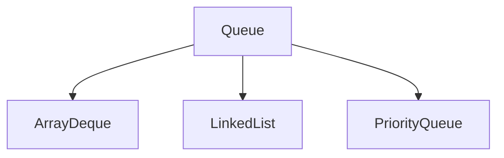

# Queue

Queue is an interface which extends Collection interface, it provides the functionality of the Queue data structure.

> FIFO (First In First Out) or LILO (Last In Last Out)

Queue interface has all the methods of the collection interface.

- Insert specified element in to the queue
> add()   -  If successfull returns _true_ otherwise throws an _exception_.<br>
> offer() -  If successfull returns _true_ otherwise returns _false_

- Fetch head of the Queue
> element()  -  returns head of the queue, otherwise throws an exception if the queue is empty.<br>
> peek()     -  returns head of the queue, otherwise returns null if the queue is empty.

- Fetch and remove head of the Queue
> remove() - Returns and removes the head of the queue. Throws an exception if the queue is empty.<br>
> poll() - Returns and removes the head of the queue. Returns null if the queue is empty.

## Interfaces extends Queue

### Deque
The Deque interface of the Java collections framework provides the functionality of a double-ended queue. It extends the Queue interface.<br>
In a regular queue, elements are added from the rear and removed from the front. However, in a deque, we can insert and remove elements from both front and rear.<br>

Besides methods available in the Queue interface, the Deque interface also includes the following methods:
```
addFirst() - Adds the specified element at the beginning of the deque. Throws an exception if the deque is full.
offerFirst() - Adds the specified element at the beginning of the deque. Returns false if the deque is full.
```

```
addLast() - Adds the specified element at the end of the deque. Throws an exception if the deque is full.
offerLast() - Adds the specified element at the end of the deque. Returns false if the deque is full.
```

```
getFirst() - Returns the first element of the deque. Throws an exception if the deque is empty.
peekFirst() - Returns the first element of the deque. Returns null if the deque is empty.
```

```
getLast() - Returns the last element of the deque. Throws an exception if the deque is empty.
peekLast() - Returns the last element of the deque. Returns null if the deque is empty.
```

```
removeFirst() - Returns and removes the first element of the deque. Throws an exception if the deque is empty.
pollFirst() - Returns and removes the first element of the deque. Returns null if the deque is empty.
```

```
removeLast() - Returns and removes the last element of the deque. Throws an exception if the deque is empty.
pollLast() - Returns and removes the last element of the deque. Returns null if the deque is empty.
```


### BlockingQueue
The BlockingQueue interface of the Java Collections framework extends the Queue interface. It allows any operation to wait until it can be successfully performed.<br>

For example, if we want to delete an element from an empty queue, then the blocking queue allows the delete operation to wait until the queue contains some elements to be deleted.

In order to use the functionality of the ```BlockingQueue```, we need to use classes that implement it.

put() and take() methods distinguish the blocking queue from other typical queues.

[ArrayBlockingQueue]() <br>
[LinkedBlockingQueue]()

```java
    // Array implementation of BlockingQueue
    BlockingQueue<String> animal1 = new ArraryBlockingQueue<>();

    // LinkedList implementation of BlockingQueue
    BlockingQueue<String> animal2 = new LinkedBlockingQueue<>();
```
#### Methods that throw an exception
```
    add() - Inserts an element to the blocking queue at the end of the queue. Throws an exception if the queue is full.
    element() - Returns the head of the blocking queue. Throws an exception if the queue is empty.
    remove() - Removes an element from the blocking queue. Throws an exception if the queue is empty.
```
##### Methods that return some value
```
    offer() - Inserts the specified element to the blocking queue at the end of the queue. Returns false if the queue is full.
    peek() - Returns the head of the blocking queue. Returns null if the queue is empty.
    poll() - Removes an element from the blocking queue. Returns null if the queue is empty.
```

The offer() and poll() method can be used with timeouts. That is, we can pass time units as a parameter. For example,
```
    offer(value, 100, milliseconds)
```
This means the offer() method will try to insert an element to the blocking queue for 100 milliseconds. If the element cannot be inserted in 100 milliseconds, the method returns false.

> Note: Instead of milliseconds, we can also use these time units: days, hours, minutes, seconds, microseconds and nanoseconds in offer() and poll() methods.

#### Methods that blocks the operation
The BlockingQueue also provides methods to block the operations and wait if the queue is full or empty.
```
    put() - Inserts an element to the blocking queue. If the queue is full, it will wait until the queue has space to insert an element.
    take() - Removes and returns an element from the blocking queue. If the queue is empty, it will wait until the queue has elements to be deleted.
```
Suppose, we want to insert elements into a queue. If the queue is full then the put() method will wait until the queue has space to insert elements.

Similarly, if we want to delete elements from a queue. If the queue is empty then the take() method will wait until the queue contains elements to be deleted.

#### Why BlockingQueue?

In Java, BlockingQueue is considered as the thread-safe collection. It is because it can be helpful in multi-threading operations.

Suppose one thread is inserting elements to the queue and another thread is removing elements from the queue.

Now, if the first thread runs slower, then the blocking queue can make the second thread wait until the first thread completes its operation.


## Queue Implementations



### ArrayDeque

```java

```

### LinkedList

```java
    Queue<Integer> linkedList = new LinkedList<>();
```

### PriorityQueue

PriorityQueue class provides the functionality of the [heap data structure]().

```java
    Queue<Integer> priorityQueue = new PriorityQueue<>();
```

### ArrayBlockingQueue
The ArrayBlockingQueue class of the Java Collections framework provides the blocking queue implementation using an array.
```java
    ArrayBlockingQueue<Type> animal = new ArrayBlockingQueue<>(int capacity);
    
    Type - the type of the array blocking queue
    capacity - the size of the array blocking queue
    
    ArrayBlockingQueue<String> animals = new ArrayBlockingQueue<>(5);
    ArrayBlockingQueue<Integer> age = new ArrayBlockingQueue<>(5);
```
> Note: It is compulsory to provide the size of the array.


#### Why use ArrayBlockingQueue?
The ArrayBlockingQueue uses arrays as its internal storage.

It is considered as a thread-safe collection. Hence, it is generally used in multi-threading applications.

### LinkedBlockingQueue

The LinkedBlockingQueue class of the Java Collections framework provides the blocking queue implementation using a linked list.
```java
    LinkedBlockingQueue<Type> animal = new LinkedBlockingQueue<>();
    default initial capacity will be 231-1.
    
    LinkedBlockingQueue<Type> animal = new LinkedBlockingQueue<>(int capacity);
    LinkedBlockingQueue<String> animals = new LinkedBlockingQueue<>(5);
    Type - the type of the linked blocking queue
    capacity - the size of the linked blocking queue

```
> Note: It is not compulsory to provide the size of the linked list.


```java
iterator() - Returns an iterator object to sequentially access elements from the array blocking queue. It throws an exception if the queue is empty. We must import the java.util.Iterator package to use it.
    ArrayBlockingQueue<String> animals = new ArrayBlockingQueue<>(5);
    Iterator<String> iterate = animals.iterator();
    while(iterate.hasNext()) {
            System.out.print(iterate.next());
            System.out.print(", ");
    }
    
Try all the methods and list what are specifc 
clear() - Removes all the elements from the array blocking queue.

put() and take() Method
In multithreading processes, we can use put() and take() to block the operation of one thread to synchronize it with another thread. These methods will wait until they can be successfully executed.
```
