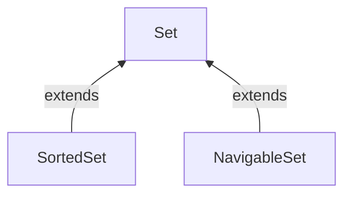
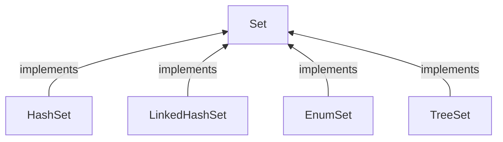

# Set
The Set interface of the Java Collections framework provides the features of the mathematical set in Java. It extends the Collection interface.

> Unlike the List interface, sets cannot contain duplicate elements.

Some of the commonly used methods of the Collection interface that's also available in the Set interface are:

```java
add() - adds the specified element to the set
addAll() - adds all the elements of the specified collection to the set
iterator() - returns an iterator that can be used to access elements of the set sequentially
remove() - removes the specified element from the set
removeAll() - removes all the elements from the set that is present in another specified set
retainAll() - retains all the elements in the set that are also present in another specified set
clear() - removes all the elements from the set
size() - returns the length (number of elements) of the set
toArray() - returns an array containing all the elements of the set
contains() - returns true if the set contains the specified element
containsAll() - returns true if the set contains all the elements of the specified collection
hashCode() - returns a hash code value (address of the element in the set)
```
**Set Operations**
```java
The Java Set interface allows us to perform basic mathematical set operations like union, intersection, and subset.

Union - to get the union of two sets x and y, we can use x.addAll(y)
Intersection - to get the intersection of two sets x and y, we can use x.retainAll(y)
Subset - to check if x is a subset of y, we can use y.containsAll(x)
```

## Interfaces that extend Set


### SortedSet

### NavigableSet

## Classes that implement Set




### HashSet
In Java, HashSet is commonly used if we have to access elements randomly. It is because elements in a hash table are accessed using hash codes.

The hashcode of an element is a unique identity that helps to identify the element in a hash table.

HashSet cannot contain duplicate elements. Hence, each hash set element has a unique hashcode.

> Note: HashSet is not synchronized. That is if multiple threads access the hash set at the same time and one of the threads modifies the hash set. Then it must be externally synchronized.
### LinkedHashSet
### EnumSet
### TreeSet
