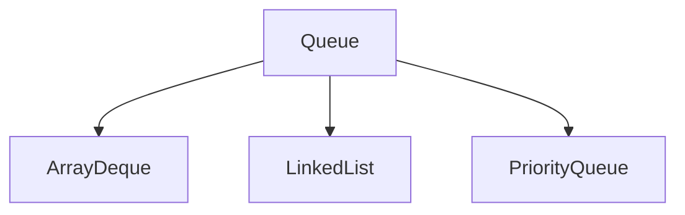

# Queue

Queue is an interface which extends Collection interface, it provides the functionality of the Queue data structure.

> FIFO (First In First Out) or LILO (Last In Last Out)

Queue interface has all the methods of the collection interface.

- Insert specified element in to the queue
> add()   -  If successfull returns _true_ otherwise throws an _exception_.<br>
> offer() -  If successfull returns _true_ otherwise returns _false_

- Fetch head of the Queue
> element()  -  returns head of the queue, otherwise throws an exception if the queue is empty.<br>
> peek()     -  returns head of the queue, otherwise returns null if the queue is empty.

- Fetch and remove head of the Queue
> remove() - Returns and removes the head of the queue. Throws an exception if the queue is empty.<br>
> poll() - Returns and removes the head of the queue. Returns null if the queue is empty.

## Interfaces extends Queue

### Deque
The Deque interface of the Java collections framework provides the functionality of a double-ended queue. It extends the Queue interface.<br>
In a regular queue, elements are added from the rear and removed from the front. However, in a deque, we can insert and remove elements from both front and rear.<br>

Besides methods available in the Queue interface, the Deque interface also includes the following methods:
```
addFirst() - Adds the specified element at the beginning of the deque. Throws an exception if the deque is full.
offerFirst() - Adds the specified element at the beginning of the deque. Returns false if the deque is full.
<br>
addLast() - Adds the specified element at the end of the deque. Throws an exception if the deque is full.
offerLast() - Adds the specified element at the end of the deque. Returns false if the deque is full.
<br>
getFirst() - Returns the first element of the deque. Throws an exception if the deque is empty.
peekFirst() - Returns the first element of the deque. Returns null if the deque is empty.
<br>
getLast() - Returns the last element of the deque. Throws an exception if the deque is empty.
peekLast() - Returns the last element of the deque. Returns null if the deque is empty.
<br>
removeFirst() - Returns and removes the first element of the deque. Throws an exception if the deque is empty.
pollFirst() - Returns and removes the first element of the deque. Returns null if the deque is empty.
<br>
removeLast() - Returns and removes the last element of the deque. Throws an exception if the deque is empty.
pollLast() - Returns and removes the last element of the deque. Returns null if the deque is empty.
```


### BlockingQueue

### BlockingDeque


## Queue Implementations



### ArrayDeque

```java

```

### LinkedList

```java
    Queue<Integer> linkedList = new LinkedList<>();
```

### PriorityQueue

PriorityQueue class provides the functionality of the [heap data structure]().

```java
    Queue<Integer> priorityQueue = new PriorityQueue<>();
```

